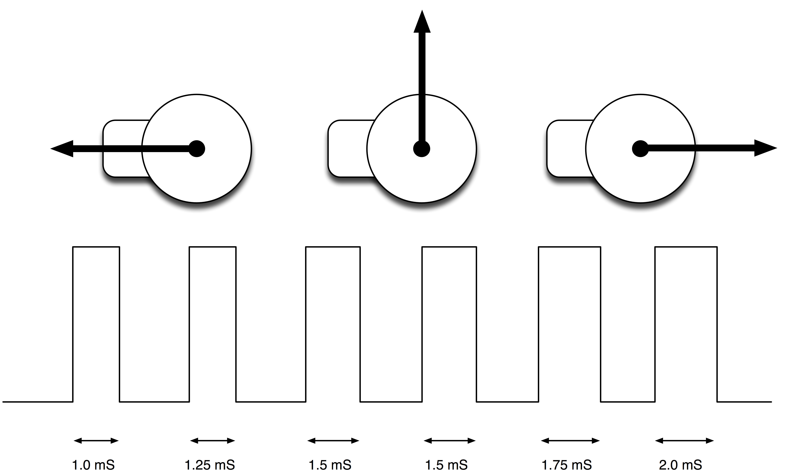

title = 'Lab 7 - A/D Conversion - "Robot Sensing"'

# Lab 7 - "Robot Sensing"

[Teaching Notes](notes.html)

**[A Note On Robot Sharing](/382/labs/lab6/other_peoples_robots.html)**

## Overview

This lab is designed to assist you in learning the concepts associated with the input capture features for your MSP430.  A single ultrasonic rangefinder is attached to a servo motor that can rotate.  You will program your MSP430 to use the rangefinder to determine whether your mobile robot is approaching a wall in front or on one of its sides.  The skills you will learn from this lab will come in handy in the future as you start interfacing multiple systems.

## Sensor Boards

Each robot has one rangefinder/servo pair.  By using the headers available to you on the top of the robot PCB, you can read a pulsewidth that is proportional to the distance between an object and the sensor. You will need to send the servo a pulse of a particular length in order to rotate the sensor to each side and back to the center position.

For more information on servos, see the Seattle Robotics Society page on ["What is a Servo?"](http://www.seattlerobotics.org/guide/servos.html)

## Prelab

See the following [Prelab page](Prelab.html).

## Required Functionality

Use the Timer_A subsystem to light LEDs based on the presence of a wall.  The presence of a wall on the left side of the robot should light LED1 on your Launchpad board.  The presence of a wall next to the right side should light LED2 on your Launchpad board.  A wall in front should light both LEDs.  Demonstrate that the LEDs do not light until the sensor comes into close proximity with a wall.

## B Functionality

You need to fully characterize the sensor for your robot.  Create a table and graphical plot with at least three data points that shows the rangefinder pulse lengths for a variety of distances from a maze wall to the front/side of your robot.  This table/graph should be generated for only **one servo position**.  Use these values to determine how your sensor works so you can properly use it with the servo to solve the maze.  **How do these experimental values compare to the timing values that you calculated in the Prelab?**

## A Functionality

Control your servo position with your remote!  Use remote buttons other than those you have used for the motors.  Note: you still need to be able to get readings from the ultrasonic sensor after changing your servo position with the remote.

## Bonus Functionality

Create a standalone library for your ultrasonic code and release it on Bitbucket.  This should be separate folder from your lab code.  It should have a thoughtful interface and README, capable of being reused in the robot maze laboratory.  This particular repository will remain private.

## Lab Hints

- Be sure you write a quality header/implementation file so you can easily import this code for the maze competition.

## Grading - Lab 7
[Printable Combined Lab 7&8 Cutsheet](Lab_7-8_Cutsheet.pdf)

**Name:** 
 
**Section:**
 
 
**Documentation:** 
 

| Item | Grade | Points | Out of | Date | Due |
|:-: | :-: | :-: | :-: | :-: |
| Prelab | **On-Time:** Zero ---- Check Minus ---- Check ---- Check Plus | | 15 | | BOC L37 |
| Required Functionality | **On-Time:** -------------------------------------------------------------------- **Late:** 1Day ---- 2Days ---- 3Days ---- 4+Days| | 40 | | COB L38 |
| B Functionality | **On-Time:** -------------------------------------------------------------------- **Late:** 1Day ---- 2Days ---- 3Days ---- 4+Days| | 10 | | COB L38 |
| A Functionality | **On-Time:** -------------------------------------------------------------------- **Late:** 1Day ---- 2Days ---- 3Days ---- 4+Days| | 10 | | COB L38 |
| Bonus Functionality | **On-Time:** -------------------------------------------------------------------- **Late:** 1Day ---- 2Days ---- 3Days ---- 4+Days | | 5 | | COB L38 |
| Use of Git | **On-Time:** Zero ---- Check Minus ---- Check ---- Check Plus ---- **Late:** 1Day ---- 2Days ---- 3Days ---- 4+Days| | 5 | | COB L40 |
| Code Style | **On-Time:** Zero ---- Check Minus ---- Check ---- Check Plus ---- **Late:** 1Day ---- 2Days ---- 3Days ---- 4+Days| | 10 | | COB L40 |
| README | **On-Time:** Zero ---- Check Minus ---- Check ---- Check Plus ---- **Late:** 1Day ---- 2Days ---- 3Days ---- 4+Days| | 10 | | COB L40 |
| **Total** | | | **100** | | | |
