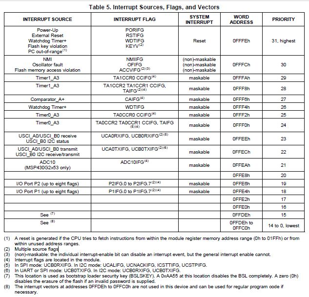

title = 'Timer A (Interval Timing)'

# Lesson 25 Notes

## Readings
- Barrett 6.10 (pp197-213)
- [Family Users Guide](/382/datasheets) pp355-373 - Timer_A
- [PPT Slides](Lsn25.pptx)

## Lesson Outline

- Timer_A


## Timer_A

Timer A is a 16-bit timer / counter with multiple features.  Today, we'll talk a bit about how it works and how to use it to perform interval timing.  Say, for instance, your MSP430 was powering a weather station.  You want to get a temperature reading every 10 seconds.  With Timer A and interrupts, you could put your chip into a low power state, waking up periodically to take readings.  Cool!

### Block Diagram

Let's take a look at the Timer_A Block Diagram and learn a little about how it works.


Today we'll focus on the top block - the Timer Block.

Things to note:

- TASSELx bits
    - These select the clock signal Timer_A counts off of
    - In actuality, selects one of four inputs to a multiplexer
- IDx
    - Allows us to slow down this frequency by dividing it
    - Say we had a 1MHz clock source:
        - Divide by 2: 500kHz
        - Divide by 4: 250kHz
        - Divide by 8: 125 kHz
- TAR - Timer A Register
    - This is is the register that holds the current count
    - Counts off of the clock source we selected
    - TACLR bit clears it
    - RC tells us when the timer rolls over - can trigger an interrupt!
- Count Mode
    - Specifies the way the timer counts (we'll cover later)

Note MUXs, AND gates, OR gates, flip flops.

### General Functionality

Go to Family Users Guide pp356.

**TACTL** - controls most of these elements


The Timer A Register (TAR) increments or decrements (depending on mode) with each rising edge of the clock.

We can clear TAR by setting the TACLR bit.

It's recommended to stop the timer before modifying its operation to avoid weird operating conditions.

To stop the timer, we can set the mode control bits to `00`.

To start the timer, we can set it to one of three modes: up, continuous, and up / down.


**Timer Modes:**

Up Mode counts from 0 to the value in register TACCR0.  When it hits TACCR0, the CCIFG interrupt flag is set.  When it hits 0 (the next tick), the TAIFG interrupt flag is set.


Continuous mode counts from 0 to 0xffff.  When it hits 0, the TAIFG interrupt flag is set.


Up / down mode counts from 0 to the value in register TACCR0, then back down to 0.  When it hits TACCR0, the CCIFG interrupt flag is set.  When it hits 0, the TAIFG interrupt flag is set.


### Timer_A on the msp430g2553

Your msp430g2553 has two Timer_A subsystems, as shown on the interrupt vector table:



And each of these can trigger multiple interrupts - corresponding to two ISRs.

There is a typo on the image - TA0CCR2 and TA0CCR1 CCIFG, TAIFG trigger the A1 vector, TA0CCR0 CCIFG triggers the A0 vector.

We'll talk about TA0CCR0, TA0CCR1, and TA0CCR2 more before the motors lab - these will allow us to implement Pulse Width Modulation.

### Interval Timing - Flash LEDs

Let's use this to perform an action at a specified time interval.  Remember the programmer's job with respect to interrupts:

1. Initialize
    - Configure subsystem
        - Stop timer!
            - Set Mode Control to 00 in TACTL
        - Clear TAR
            - Set TACLR bit in TACTL
        - Set for continuous mode
            - Set Mode Control to 10 in TACTL
	- Select the clock I want to count off of
		- Set TASSEL1 to select SMCLK
	- Select divider value
		- Set ID1 and ID0 to divide clock by 8
    - Clear interrupt flag
        - Clear TAIFG in TACTL
	- Start clock
		- Set count mode to continuous by setting MC1
    - Turn on local switch
        - Set TAIE in TACTL
    - Turn on global switch
        - Set the GIE bit in the SR
2. Write ISR
    - Include `#pragma vector` statement and subroutine itself
        - `#pragma vector=TIMER0_A1_VECTOR` 
        - NOTE: This vector gets triggered by multiple causes!
            - In our case, we only enabled the TAIE interrupt so we know the cause
    - Clear interrupt flag
        - Clear TAIFG in TACTL
    - Accomplish task
        - Toggle LEDs!
3. Give interrupt opportunity to occur
    - It might take some time!

### Implementation of Flash LEDs

```
char flag = 0;                  // global variable to share info between main and ISR

int main(void)
{
    WDTCTL = WDTPW|WDTHOLD;     // stop the watchdog timer

    P1DIR |= BIT0|BIT6;         // set LEDs to output 

    TA0CTL &= ~(MC1|MC0);        // stop timer

    TA0CTL |= TACLR;             // clear TAR

    TA0CTL |= TASSEL_2;          // configure for SMCLK - what's the frequency (roughly)?

    TA0CTL |= ID_3;    		     // divide clock by 8 - what's the frequency of interrupt?

    TA0CTL &= ~TAIFG;            // clear interrupt flag

    TA0CTL |= MC_1;              // set count mode to continuous

    TA0CTL |= TAIE;              // enable interrupt

    __enable_interrupt();       // enable maskable interrupts

    int count = 0;

    while(1)
    {
        // do other useful stuff

        // respond to interrupt if it occurred
        // flag is global variable used to share information between main and the ISR
        if (flag)
        {
            flag = 0;
            P1OUT ^= BIT0;
            if (count)
            {
                P1OUT ^= BIT6;
                count = 0;
            } else
                count++;
        }
    }

}

// Flag for continuous counting is TAIFG
#pragma vector=TIMER0_A1_VECTOR
__interrupt void TIMER0_A1_ISR()
{
    TA0CTL &= ~TAIFG;            // clear interrupt flag
    flag = 1;
}
```

